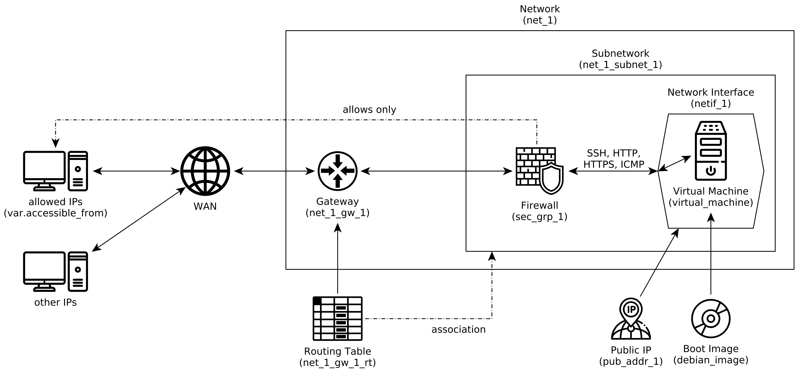
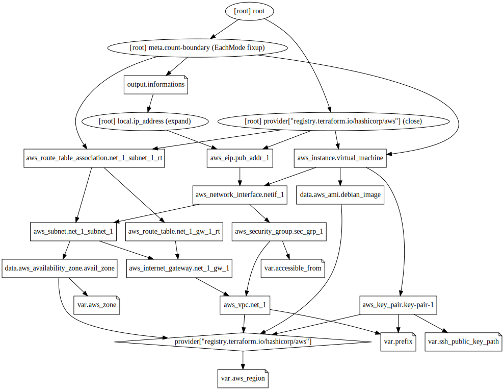

# Amazon Web Services - Simple Web Server

Deploy simple web server provided by [nginx](https://www.nginx.com/) in [debian 10](https://www.debian.org/index.html) to [amazon elastic compute cloud](https://aws.amazon.com/ec2) using [terraform](https://www.terraform.io/).

##### Deployed Infrastructure



##### Dependency Graph



### Setup

1. prerequisites installation

    1. create [AWS Account](https://aws.amazon.com/)
        * generate access key
    1. install [AWS CLI](https://docs.aws.amazon.com/cli/latest/userguide/cli-chap-install.html)
    1. install [Terraform](https://learn.hashicorp.com/tutorials/terraform/install-cli)

1. environment configuration

    ```bash
    mkdir -p ~/.aws
    
    cat <<EOS > ~/.aws/config
    [default]
    region = us-east-1
    EOS
    
    cat <<EOS > ~/.aws/credentials
    [default]
    aws_access_key_id = <your AWS access key ID>
    aws_secret_access_key = <your AWS secret access key>
    EOS
    
    # secure the files
    chmod 0600 ~/.aws/config ~/.aws/credentials
    ```

1. clone this repository and `cd` into it

1. create SSH key pair

    ```bash
    ssh-keygen -t rsa -b 4096 -C "terraform" -f ./ssh/key
    ```

1. configure terraform variables (set your custom values)

    ```bash
    # create variable file
    cp .terraform.tfvars.example terraform.tfvars

    # set custom variable values
    vi terraform.tfvars
    ```

1. deployment

    ```bash
    # download module(s)
    terraform init

    # deploy
    terraform apply
    ```
